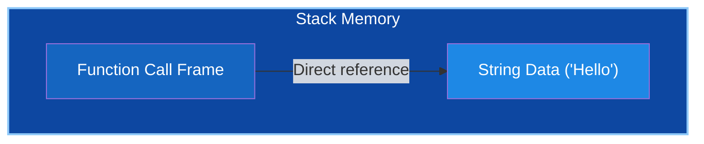
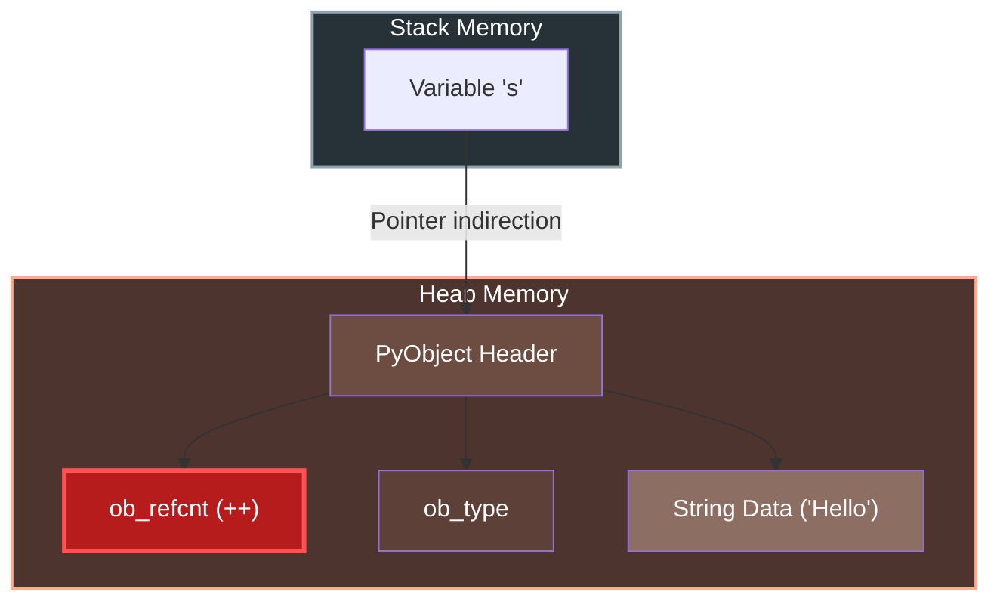
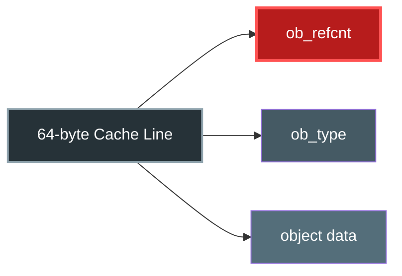
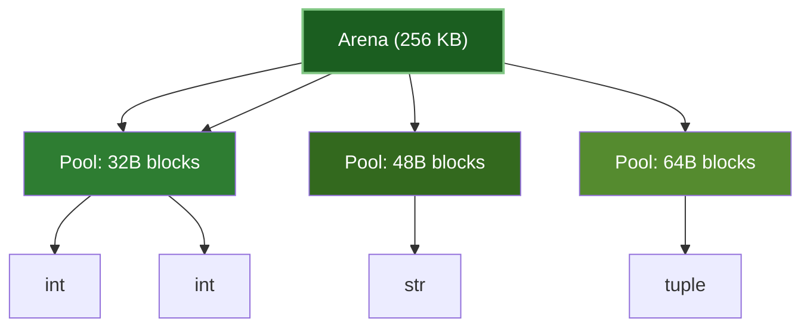

# Microbench: L1 Cache & Indirection Overhead

I designed this project to objectively measure the hardware-level cost of Python's object model (`PyObject`) compared to C++ and Rust.

## Objective
My goal was to isolate the performance impact of:
1.  **Pointer Indirection**: Python variables are pointers to variables on the heap, whereas C++/Rust use direct stack allocation.
2.  **Reference Counting**: Every variable assignment in Python involves writing to the heap (`ob_refcnt`), causing L1 cache pollution.
3.  **Memory Layout**: The lack of contiguous memory locality in standard Python.

## Benchmarks
I implemented the same logic—passing a small string to a function 100 million times—across three languages.

-   `cpp/`: C++ implementation (`g++ -O3`)
-   `rust/`: Rust implementation (`rustc -O`)
-   `python/`: Python implementation (CPython & PyPy)

## Visualizing the Overhead

To understand *why* Python is slower, look at how memory is handled when passing a string `s`.

**C++ / Rust (Zero Overhead)**
The string lives on the stack. Passing it relies on a simple pointer or reference. **No heap writes occur.**



**Python (The PyObject Tax)**
The variable `s` is just a pointer. The actual data lives on the heap in a heavy `PyObject` struct. Every pass triggers a write to `ob_refcnt`.



> **The Red Box**: That `ob_refcnt++` is the bottleneck. It forces a write to the heap on *every single assignment*, destroying L1 cache locality.

## Python's Memory Model
In C++, `int x = 42` allocates 4 bytes on the stack. In Python, `x = 42` allocates a heap object.

Every Python object is fundamentally a `PyObject` C-struct. This adds significant overhead:
1.  **Heap Allocation**: All objects live on the heap; the "variable" is just a stack pointer to them.
2.  **Metadata Overhead**: Even a simple integer wraps the value with reference counting and type information.
3.  **PyMalloc**: Python uses a specialized allocator (arenas/pools) for small objects to reduce fragmentation, but it still incurs management overhead compared to a raw pointer increment.

**Rough C++ Equivalent of a Python Integer:**
```cpp
// A "simple" Python integer is actually this struct on the heap
struct PyObject {
    long ob_refcnt;       // 8 bytes: Memory management
    PyTypeObject* ob_type;// 8 bytes: RTTI / Dynamic Dispatch
};

struct PyLongObject {
    PyObject ob_base;     // 16 bytes overhead
    long ob_digit[1];     // The actual value matches here
};
// Total: ~24+ bytes for a 4-byte integer value
```


Python’s allocator (`pymalloc`) is optimized for **fast allocation**, not for **cache locality**. To see why this matters, it helps to look at how a single Python object maps onto CPU cache lines.

A typical cache line is **64 bytes**. A typical Python object begins with a `PyObject` header:

```c
struct PyObject {
    long ob_refcnt;        // 8 bytes
    PyTypeObject* ob_type; // 8 bytes
};
```

For a small object (like an integer or short string), this header and the object payload often share the same cache line.



Every time Python executes:

```python
t = s
```

it must increment `s->ob_refcnt`. That single write **dirties the entire cache line**, even though the program is about to *read* the object’s data. The cost is not the increment—it is the **cache invalidation**.

---

## How Arenas Hurt Spatial Locality

`pymalloc` allocates memory in **arenas (256 KB)** which is not so [uncommon indeed](https://protobuf.dev/reference/cpp/arenas/), subdivided into **pools (4 KB)**, each pool serving exactly one object size class.

This means objects that are *logically related* are often **physically far apart** in memory.



Objects created next to each other in source code may:

* Live in **different pools**
* Be separated by **kilobytes or megabytes**
* Share no cache lines at all

Iteration over Python objects therefore becomes **pointer chasing across arenas**, defeating hardware prefetching.

---

## Cache Efficiency & PyObject Overhead
The Python slowdown comes from the `PyObject` structure:
1.  **Indirection**: Python variables are pointers to `PyObject` structs on the heap. C++/Rust variables (in this test) are direct pointers or stack values.
2.  **Refcounting**: Every assignment `t = s` triggers:
    -   `s->ob_refcnt++` (Write to Heap)
    -   `old_t->ob_refcnt--` (Write to Heap)
    -   **Cache Impact**: These writes dirty the cache line where the PyObject lives, potentially evicting other useful data.
    -   **C++/Rust**: Passing `const string&` reads the pointer from the stack. It does **not** write to the heap string object.
3.  **No SSO**: C++ uses Small String Optimization (SSO) to store small strings directly on the stack. Python always allocates a PyObject header + data on the heap.

## Usage

To run the full cross-language comparison:
```bash
make bench_languages
```

To run the detailed Python optimization analysis (including Cython, PyPy, etc.):
```bash
make bench_python
```

For a deep dive into the Python-specific optimizations and finding the "PyObject Ceiling", see [python_optimized/README.md](python_optimized/README.md).
