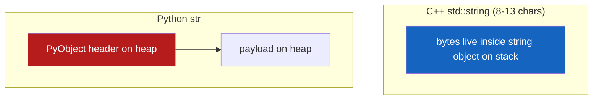
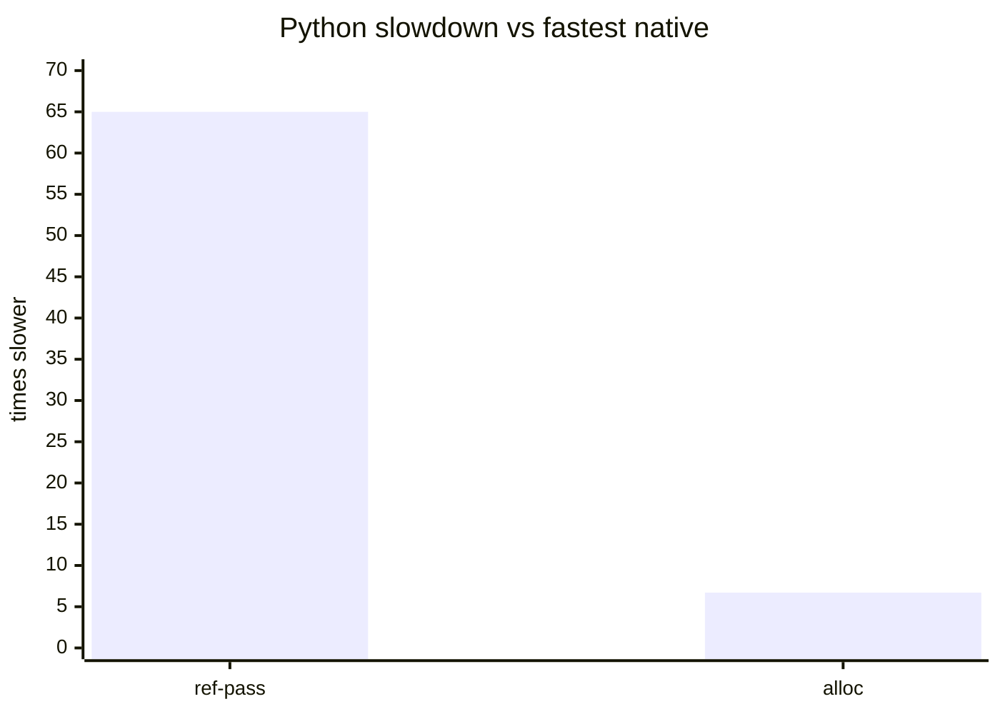

# Allocation

`"prefix_" + str(i)` one million times.

## Results

| Language | Mean | vs C++ |
|:--|--:|--:|
| C++ | 11.8 ms | 1× |
| Rust | 23.7 ms | 2× |
| Python | 79 ms | 6.7× |

Raw: `results_bench_alloc.md`.

<div class="chart-grid" markdown="0">
  <div class="chart-card">
    <h3>Wall clock</h3>
    <canvas id="chart-alloc-timing"></canvas>
  </div>
</div>

## Why C++ wins here (SSO)



Rust `format!` always hits the heap. Slower than C++ SSO, still faster than building a full PyUnicodeObject.

## Gap vs reference passing



Everyone pays for allocation. Python's pymalloc holds up reasonably well. The PyObject header (~80+ bytes) still hurts next to a 13-char SSO buffer.

## Cachegrind (alloc)

Same cachegrind pipeline as [reference passing](reference-passing.md#cachegrind-ref-pass). Gap vs ref-pass shrinks because everyone spends cycles in the allocator.

| | C++ | Python | ratio |
|:--|--:|--:|--:|
| Instructions | 304M | 2,223M | 7.3× |
| L1 misses | 15K | 827K | 55.9× |

<div class="chart-grid" markdown="0">
  <div class="chart-card">
    <h3>Instructions (millions)</h3>
    <canvas id="chart-alloc-instr"></canvas>
  </div>
  <div class="chart-card">
    <h3>L1 data cache misses</h3>
    <canvas id="chart-alloc-d1"></canvas>
  </div>
  <div class="chart-card">
    <h3>Last-level cache misses</h3>
    <canvas id="chart-alloc-ll"></canvas>
  </div>
  <div class="chart-card">
    <h3>Python divided by C++</h3>
    <canvas id="chart-alloc-ratio"></canvas>
  </div>
  <div class="chart-card">
    <h3>Overhead split (estimated)</h3>
    <canvas id="chart-alloc-overhead"></canvas>
  </div>
</div>

## Source

### Python

```python title="python/bench_alloc.py"
--8<-- "python/bench_alloc.py"
```

### C++

```cpp title="cpp/bench_alloc.cpp"
--8<-- "cpp/bench_alloc.cpp"
```

### Rust

```rust title="rust/bench_alloc.rs"
--8<-- "rust/bench_alloc.rs"
```

## Run

```bash
make bench_languages
# or:
python3 python/bench_alloc.py && ./cpp/bench_alloc && ./rust/bench_alloc
```
