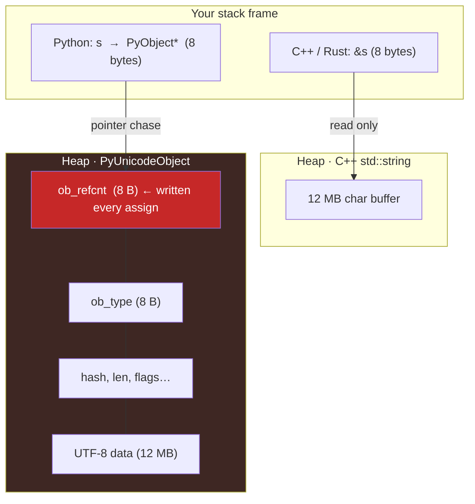
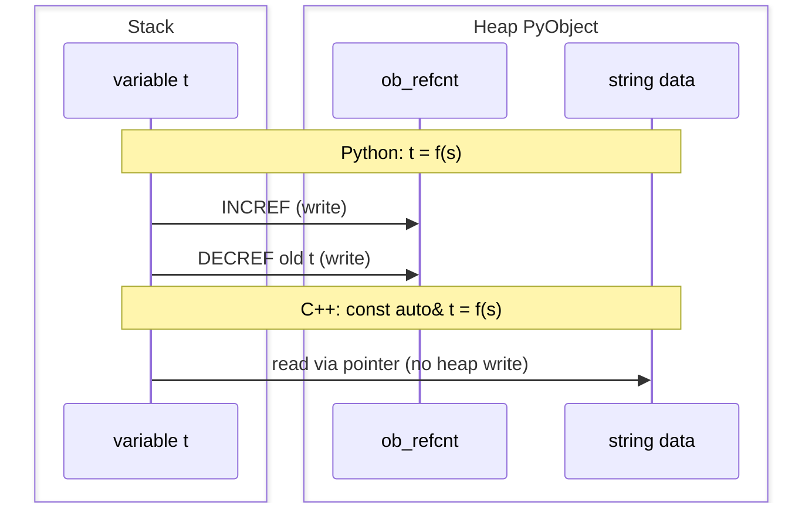
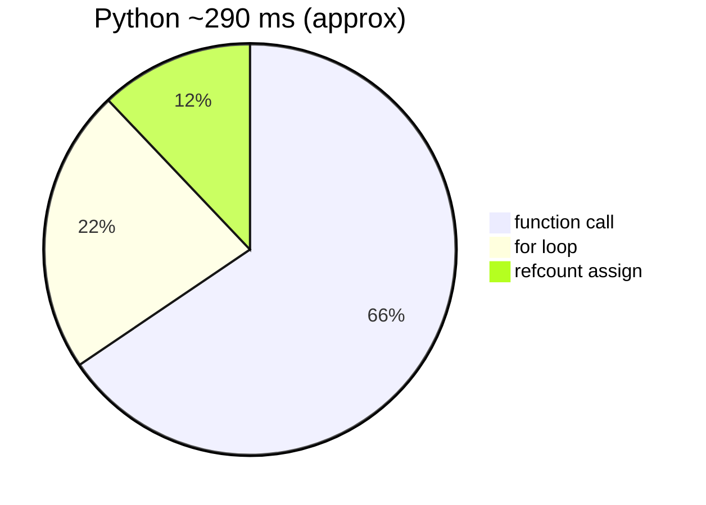

# Reference passing

One 12 MB string; `f` returns it unchanged, ten million times. No new strings are allocated.

## Results

| Language | Mean | vs Rust |
|:--|--:|--:|
| Rust | 4.5 ms | 1× |
| C++ | 6.7 ms | 1.5× |
| Python | 293 ms | 65× |

hyperfine, 3 warmup runs. Raw: `results_bench.md`.

<div class="chart-grid" markdown="0">
  <div class="chart-card">
    <h3>Wall clock</h3>
    <canvas id="chart-ref-timing"></canvas>
  </div>
</div>

## What one assignment costs

In C++/Rust, `t = f(s)` is a stack pointer copy with no heap write. In Python, every assignment INCREF/DECREF the `PyUnicodeObject` on the heap.

=== "C++"

    ```cpp
    const auto& t = f(s);  // f returns const string&
    ```

    1. Load address of `s` from stack (8 B read)
    2. Store address in `t` (8 B write, stack only)
    3. Zero heap writes

=== "Python"

    ```python
    t = f(s)   # def f(x): return x
    ```

    1. Bytecode: set up call frame, push `s`
    2. Run `f`: return `s` (INCREF on heap object)
    3. Assign to `t`: DECREF old `t`, INCREF new value
    4. Each INCREF/DECREF is a read-modify-write on `ob_refcnt`
    5. That field shares a 64 B cache line with `ob_type` and metadata, so the cache line gets dirtied even if you only wanted to read the string bytes

### Memory layout

The name `s` is an 8-byte pointer in all three languages. In Python it points at a heap struct that gets written on every assign.





The 12 MB string is on purpose: it lives on the heap in all three languages (too big for C++ small-string optimization), so this test measures refcount and dispatch, not copy cost.

## Where the time goes



Inlining to `t = s` drops the function-call slice. See `bench_02_inline.py` in [Source](#source) below.

## Cachegrind (ref-pass)

From valgrind cachegrind (`make profile`). Python runs ~100× slower under valgrind; cross-language ratios are what matter.

| | C++ | Python | ratio |
|:--|--:|--:|--:|
| Instructions | 79M | 8,774M | 111× |
| Data refs | 22M | 3,912M | 180× |
| L1 misses | 203K | 1.2M | 5.9× |

<div class="chart-grid" markdown="0">
  <div class="chart-card">
    <h3>Instructions (millions)</h3>
    <canvas id="chart-ref-instr"></canvas>
  </div>
  <div class="chart-card">
    <h3>Memory data references (millions)</h3>
    <canvas id="chart-ref-data"></canvas>
  </div>
  <div class="chart-card">
    <h3>L1 data cache misses</h3>
    <canvas id="chart-ref-d1"></canvas>
  </div>
  <div class="chart-card">
    <h3>Last-level cache misses</h3>
    <canvas id="chart-ref-ll"></canvas>
  </div>
  <div class="chart-card">
    <h3>Python divided by C++</h3>
    <canvas id="chart-ref-ratio"></canvas>
  </div>
  <div class="chart-card">
    <h3>Overhead split (estimated)</h3>
    <canvas id="chart-ref-overhead"></canvas>
  </div>
</div>

## Source

### Python

```python title="python/bench.py"
--8<-- "python/bench.py"
```

### C++

```cpp title="cpp/bench.cpp"
--8<-- "cpp/bench.cpp"
```

### Rust

```rust title="rust/bench.rs"
--8<-- "rust/bench.rs"
```

### Python without the call

```python title="python_optimized/bench_02_inline.py"
--8<-- "python_optimized/bench_02_inline.py"
```

| variant | ~time |
|:--|--:|
| `t = f(s)` | 290 ms |
| `t = s` | 100 ms |
| C++ / Rust | 2-7 ms |

## Run

```bash
make bench_languages
# or:
python3 python/bench.py && ./cpp/bench && ./rust/bench
```
