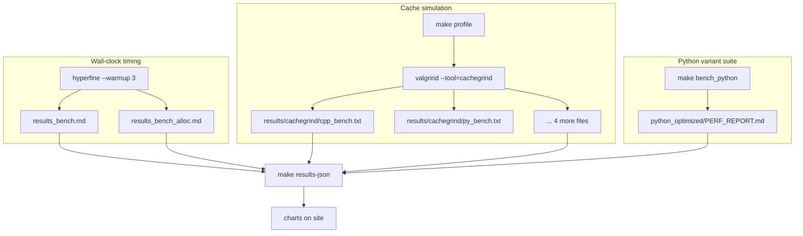

# Methodology

How every chart on this site is produced. Dashboard numbers load from `docs/data/benchmarks.json`, rebuilt by `make results-json`.

## Two benchmarks

| | Reference passing | Allocation |
|:--|:--|:--|
| Loop body | `t = f(s)` | `t = make_obj(i)` |
| String | 12 MB, built once | 8-13 chars, new each iter |
| Iterations | 10,000,000 | 1,000,000 |
| Compilers | g++ -O3, rustc -C opt-level=3 | same |

12 MB avoids C++ small-string optimization so all languages hold string data on the heap.

## Data pipeline



### Build binaries

`make all` compiles `cpp/bench`, `rust/bench`, and alloc variants with `-O3`.

### Wall-clock timing (hyperfine)

Statistical runs with warmup, exported to markdown:

```bash
hyperfine --warmup 3 --export-markdown results_bench.md \
  'python3 python/bench.py' './cpp/bench' './rust/bench'
```

Same pattern for `results_bench_alloc.md`. These feed the timing charts (mean ± std bars).

### Cache simulation (valgrind cachegrind)

Counts instructions, memory refs, and cache misses under simulation. Slower than native, but comparable across languages:

```bash
make profile   # runs cachegrind on all 6 benchmarks
# stderr summaries land in results/cachegrind/*.txt
```

Parser in `scripts/build_results_json.py` extracts `I refs`, `D refs`, `D1 misses`, `LL misses` from each `.txt` file.

### Python optimization suite

`make bench_python` runs hyperfine, cachegrind, and `perf stat` on each variant (baseline, inline, Cython, PyPy, and others). Output: `python_optimized/PERF_REPORT.md`.

### Refresh dashboard data

`make results-json` merges all sources into `docs/data/benchmarks.json`. `make docs-serve` runs that step, then starts MkDocs.

### hyperfine (wall clock)

Runs each command multiple times with warmup. Writes markdown tables consumed by `scripts/build_results_json.py`.

Charts: timing bars, gap summary, Python variant times.

### valgrind cachegrind (simulated cache)

Not hardware counters. Valgrind replays the program and models L1/LL caches. Slow (Python ref-pass ~20 s) but apples-to-apples across languages.

```bash
make profile
# one file per benchmark, e.g.:
valgrind --tool=cachegrind --cachegrind-out-file=results/cachegrind/py_bench.out \
  python3 python/bench.py 2>&1 | tee results/cachegrind/py_bench.txt
```

Parser reads the summary block at the end of each `.txt`:

| valgrind line | JSON field |
|:--|:--|
| `I refs` | instructions_m |
| `D refs` | data_refs_m |
| `D1 misses` | d1_misses |
| `LL misses` | ll_misses |

### perf stat (hardware counters, Python suite only)

Used inside `python_optimized/benchmark_python.py` for cycles and IPC on each variant. Results merged into `PERF_REPORT.md`.

```bash
perf stat -e cycles,cache-misses,L1-dcache-load-misses python3 bench_01_baseline.py
```

### Regenerate JSON

```bash
make results-json   # or: make profile && make results-json
make docs-serve
```

## Overhead split (estimated)

Hand-tagged breakdown from `PERFORMANCE_ANALYSIS.md`. We did not measure each component separately; the split is rough intuition. See the overhead charts on the [reference passing](benchmarks/reference-passing.md#cachegrind-ref-pass) and [allocation](benchmarks/allocation.md#cachegrind-alloc) pages.

## Fairness caveats

Python includes interpreter call overhead. Baseline uses `def f(x): return x`. C++ and Rust inline to a near-zero-cost call. Inlining Python to `t = s` cuts time ~3× but leaves a ~50× gap vs C++.

C++ allocation uses SSO. Strings under ~15 chars may never call `malloc`. Python always allocates a PyObject on the heap. That is a real C++ advantage, not a pure allocator shootout.

Dead-code guards:

| lang | guard |
|:--|:--|
| C++ | `asm volatile("" :: "r"(&t) : "memory")` |
| Rust | `std::hint::black_box(t)` |
| Python | refcount side effects (no guard needed) |

## Environment

AMD Ryzen 7 9700X, WSL2, CPython 3.10.12, g++ 11.4, rustc 1.93. Absolute milliseconds vary; ratios hold.
