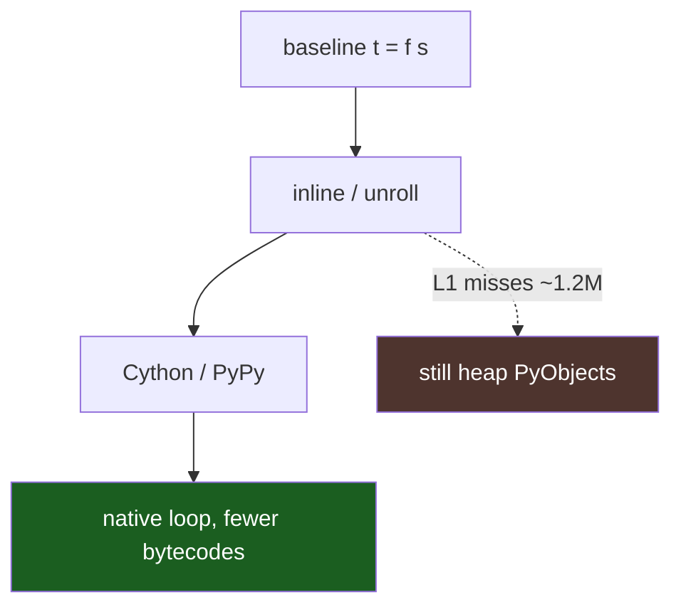
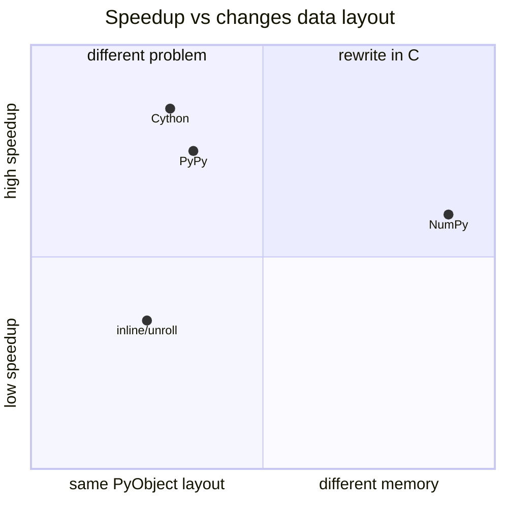

# Python optimizations

These variants test how far you can get before PyObject overhead dominates.



Pure Python tweaks buy 10-40% on instructions, sometimes more on wall time. L1 miss count barely moves because the objects stay scattered on the heap.

## Results

| | ms | speedup | instr (M) |
|:--|--:|--:|--:|
| Baseline | 296 | 1.0× | 8,944 |
| Inline | 107 | 2.8× | 2,914 |
| Loop unroll | 35 | 8.6× | 898 |
| Combined | 36 | 8.2× | 898 |
| Cython | 14 | 21× | 104 |
| PyPy3 | 30 | 10× | 230 |

Cython drops instructions from 8,944M to 104M, which is mostly the interpreter going away. The leftover ~14 ms is still refcount and memory traffic. `cdef str` is still a PyUnicodeObject.

<div class="chart-grid" markdown="0">
  <div class="chart-card">
    <h3>Wall time (ms) · hyperfine</h3>
    <canvas id="chart-py-time"></canvas>
  </div>
  <div class="chart-card">
    <h3>Speedup vs baseline</h3>
    <canvas id="chart-py-speedup"></canvas>
  </div>
  <div class="chart-card">
    <h3>Instructions (M) · cachegrind</h3>
    <canvas id="chart-py-instr"></canvas>
  </div>
  <div class="chart-card">
    <h3>L1 data misses · cachegrind</h3>
    <canvas id="chart-py-d1"></canvas>
  </div>
  <div class="chart-card">
    <h3>CPU cycles (M) · perf stat</h3>
    <canvas id="chart-py-cycles"></canvas>
  </div>
  <div class="chart-card">
    <h3>IPC · perf stat</h3>
    <canvas id="chart-py-ipc"></canvas>
  </div>
</div>

<p class="chart-note">NumPy variant omitted from charts: it runs a vectorized integer add, not this string loop.</p>

Inlining removes the function call (~3× faster) but L1 misses stay flat: the PyObject still lives in the same heap slot. Cython drops instructions ~86× by eliminating bytecode; the remaining cost is refcount traffic.

## Escape paths



The NumPy row is a different benchmark (vector add). It is not comparable to the string loop.

## Source

### Baseline

```python title="python_optimized/bench_01_baseline.py"
--8<-- "python_optimized/bench_01_baseline.py"
```

### Inline

```python title="python_optimized/bench_02_inline.py"
--8<-- "python_optimized/bench_02_inline.py"
```

### Loop unroll (10× inside each iteration)

```python title="python_optimized/bench_04_loop_unroll.py"
--8<-- "python_optimized/bench_04_loop_unroll.py"
```

### Combined

```python title="python_optimized/bench_10_combined.py"
--8<-- "python_optimized/bench_10_combined.py"
```

### Cython

```python title="python_optimized/bench_06_cython.pyx"
--8<-- "python_optimized/bench_06_cython.pyx"
```

### Runner

```python title="python_optimized/benchmark_python.py"
--8<-- "python_optimized/benchmark_python.py"
```

## Run

```bash
make bench_python
```

Needs hyperfine, valgrind, cython3. pypy3 optional. Writes `python_optimized/PYTHON_OPTIMIZATION_REPORT.md`.
