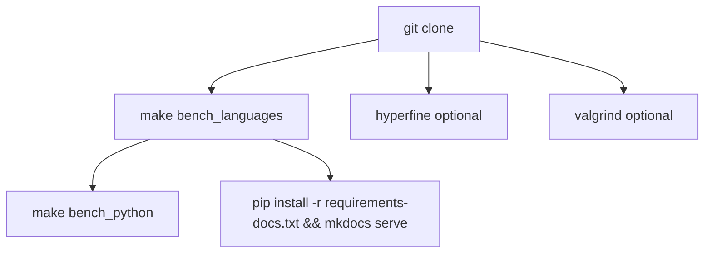

# Reproduction



## Dependencies

| tool | need |
|:--|:--|
| python3 3.10+ | yes |
| g++ -O3 | yes |
| rustc | yes |
| make | yes |
| hyperfine | timing stats |
| valgrind | cachegrind |
| cython3 | Cython bench |
| pypy3 | PyPy row |

## Commands

```bash
git clone https://github.com/abhishekshree/microbench.git
cd microbench
make bench_languages
make bench_python
```

## Makefile

```makefile title="Makefile"
--8<-- "Makefile"
```

## hyperfine

```bash
hyperfine --warmup 3 \
  'python3 python/bench.py' './cpp/bench' './rust/bench'

hyperfine --warmup 3 \
  'python3 python/bench_alloc.py' './cpp/bench_alloc' './rust/bench_alloc'
```

## cachegrind

```bash
make profile
```

## docs locally

```bash
pip install -r requirements-docs.txt
mkdocs serve
```

After re-running benchmarks:

```bash
make profile        # valgrind -> results/cachegrind/*.txt
make results-json   # hyperfine md + cachegrind + PERF_REPORT -> docs/data/benchmarks.json
make docs-serve     # refresh json, then mkdocs serve
```

Or run both in one go: `make results && make docs-serve`

## GitHub Pages

Push `main`. Repo Settings → Pages → Source: GitHub Actions.

https://abhishekshree.github.io/microbench/

## log your machine

```bash
lscpu | grep 'Model name'
python3 --version
g++ --version | head -1
rustc --version
```
